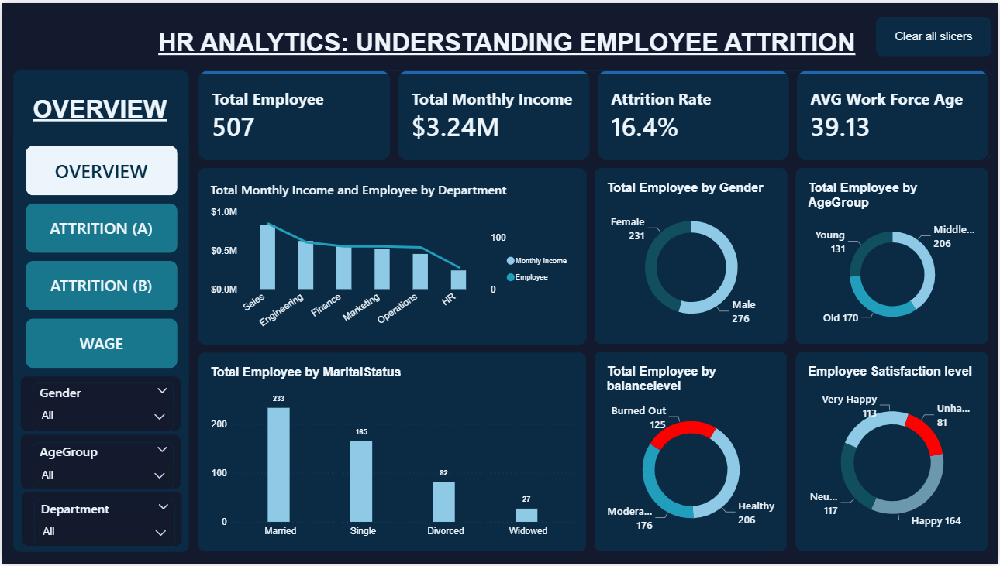
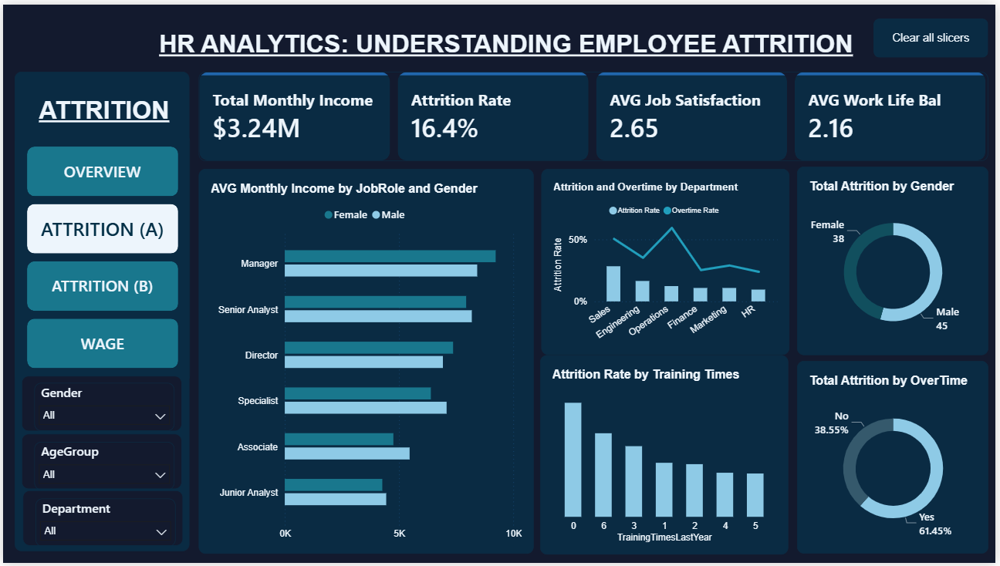
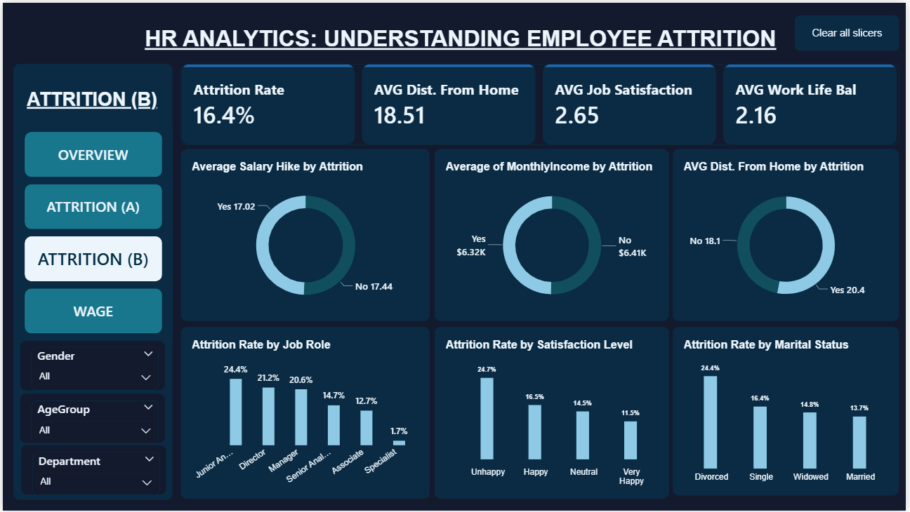
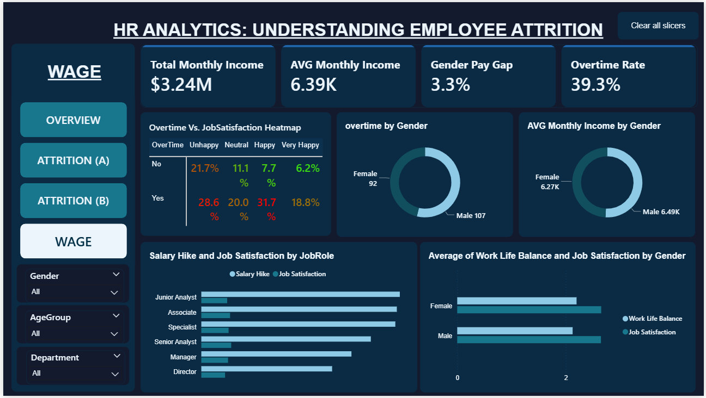

# HR Analytics: Understanding Employee Attrition

## Project Overview
Analysis of employee attrition across 507 employees to identify 
the key drivers of turnover and provide actionable HR recommendations.
Tools used: MySQL, Microsoft Excel, Power BI.

---

## Table of Contents
1. [Data Cleaning](#data-cleaning)
2. [SQL Analysis](#sql-analysis)
3. [Dashboard Overview](#dashboard-overview)
4. [Key Insights](#key-insights)
5. [Recommendations](#recommendations)

---

## Data Cleaning
The raw dataset contained several quality issues that were resolved 
before analysis:

- **Duplicate job role labels** — "Junior Analyst" and "Junior Aanlyst" 
  (typo) were merged into one category
- **Blank satisfaction levels** — rows with missing satisfactionlevel 
  values were identified and excluded from satisfaction analysis
- **Wrong aggregation types** — WorkLifeBalance and JobSatisfaction 
  columns were confirmed as ordinal scales (1–4) and treated as 
  averages, not sums
- **Column standardisation** — satisfaction and balance levels were 
  mapped from numeric scores to text labels (e.g. 1 = Unhappy, 
  4 = Very Happy) for readability in visuals
- **Data type corrections** — TrainingTimesLastYear was converted 
  from continuous numeric to categorical to display correctly on axes

---

## SQL Analysis
MySQL was used for initial data exploration and validation:

- Calculated overall attrition rate
- Segmented attrition by department, job role, gender, age group 
  and marital status
- Cross-tabulated overtime against satisfaction levels to identify 
  compound risk groups
- Verified average monthly income and salary hike parity between 
  leavers and stayers

See full script: [hr attrition.sql](hr%20attrition.sql)

---

## Dashboard Overview
A 4-page interactive Power BI dashboard was built with shared 
slicers (Gender, AgeGroup, Department) and a Clear All Slicers button.

### Page 1 — Overview

Workforce composition: headcount, income, gender split, age group, 
marital status, balance level and satisfaction distribution.

### Page 2 — Attrition (A)

Attrition by department, job role, gender, overtime, and training frequency.

### Page 3 — Attrition (B)

Deep-dive comparison of salary hike, monthly income and distance 
from home between employees who left vs stayed. Attrition rate 
by job role, satisfaction level and marital status.

### Page 4 — Wage

Compensation equity analysis including gender pay gap (3.3%), 
overtime rate, and an Overtime × Job Satisfaction heatmap.

---

## Key Insights

| # | Finding |
|---|---------|
| 1 | Overall attrition rate is **16.4%** — above the industry benchmark |
| 2 | **Sales** has the highest attrition at **28.3%** |
| 3 | Overtime employees leave at **2.5x the rate** of non-overtime staff (25.6% vs 10.4%) |
| 4 | **Unhappy** employees leave at 24.7% vs 11.5% for Very Happy employees |
| 5 | **Divorced** employees have the highest attrition by marital status at 24.4% |
| 6 | Compensation is **not** the driver — avg income ($6,317 vs $6,405) and salary hike (17.0% vs 17.4%) are nearly identical for leavers vs stayers |
| 7 | Employees who left lived **further from the office** on average (20.4km vs 18.1km) |
| 8 | A **3.3% gender pay gap** exists (Male $6.49K vs Female $6.27K avg monthly income) |

---

## Recommendations

- **Audit overtime in Sales immediately** — redistributing workload 
  or hiring relief staff could cut Sales attrition significantly
- **Launch a pulse survey** targeting Unhappy and Neutral employees 
  before they decide to leave
- **Introduce flexible/remote work** for employees commuting over 20km
- **Create a retention programme for Divorced employees** — financial 
  counselling and schedule flexibility address their specific pressures
- **Review Junior Analyst career progression** — 24.7% attrition at 
  entry level means high onboarding costs for low tenure returns
- **Address the gender pay gap** — close the 3.3% income disparity 
  to improve equity and retention among female employees

---

## Files in this Repository

| File | Description |
|---|---|
| `original_dirty_hr_att.xlsx` | Raw uncleaned dataset |
| `cleaned_hr_attrition.xlsx` | Cleaned dataset used for analysis |
| `hr attrition.sql` | MySQL queries for exploration and analysis |
| `hr attrition.pbix` | Power BI dashboard (4 pages) |
| `images/` | Dashboard screenshot previews |

---

## Tools Used
- **MySQL** — data exploration, queries, cleaning and preparation  
- **Microsoft Excel** — data exploration
- **Power BI** — interactive dashboard and DAX measures
